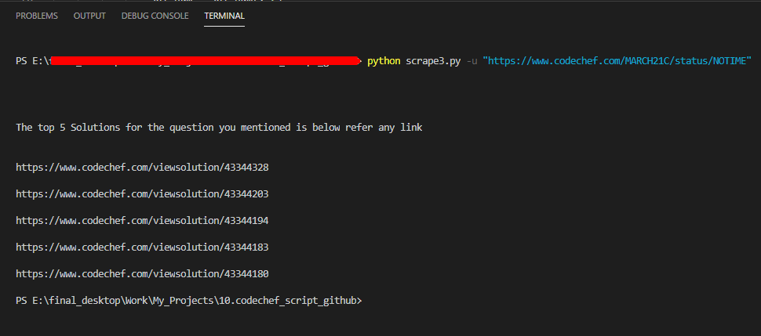

# codechefScript
Stuck at a codechef problem...want to refer a solution but confused among such a whole lot of submissions. This script for codechef automates the process of finding the best solution among thousands of programs and gives you the best according to Time & Space complexity in the language you want.

## Install the required modules first.

`pip install -r requirements.txt`

## Usage

`python3 scrape.py <command-line options and arguments>`

### Command line options
 `-u, --url` -> **Required**. Mention url of *codechef* problem submissions   
 `-l, --lang` -> **Optional**. Mention the language of solution you want. choose option u want ['pyth', 'pyth3', 'pypy', 'pypy3', 'c', 'cpp14', 'cpp17', 'java']   
 `-s, --sort` -> **Optional**. To sort the best solutions according to *Time* or *Space* complexity. choose options you want [Time, Mem, Date]  

### Examples
#### Searching without any language and sort (default will be cpp14 and Time)
`python3 scrape.py -u "<URL HERE>"`

#### Searching with language
`python3 scrape.py -u "<URL HERE>" -l pyth3`

#### Searching with best Time or Space complexity
`python3 scrape.py -u "<URL HERE>" -s Mem`

 

### RESULTS
